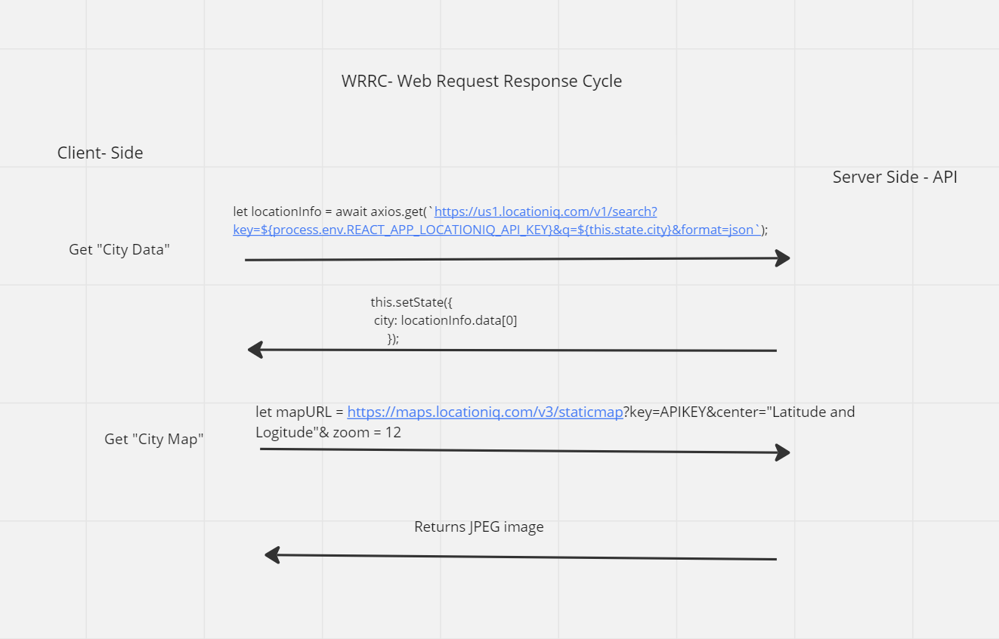

# City Explorer

**Author**: Gordon P Reilley Jr

**Version**: 1.0.0

## Overview
<!-- Provide a high level overview of what this application is and why you are building it, beyond the fact that it's an assignment for this class. (i.e. What's your problem domain?) -->

 A React application that uses the Axios library to make user-initiated requests for data from a third-party API.

## Getting Started
<!-- What are the steps that a user must take in order to build this app on their own machine and get it running? -->

## Architecture
<!-- Provide a detailed description of the application design. What technologies (languages, libraries, etc) you're using, and any other relevant design information. -->

Languages used: HTML, CSS, JavaScript

Libraries used: Node.JS, React.JS, Bootstrap

## Change Log
<!-- Use this area to document the iterative changes made to your application as each feature is successfully implemented. Use time stamps. Here's an example:

01-01-2001 4:59pm - Application now has a fully-functional express server, with a GET route for the location resource. -->

1. Feature 1: Set-up Project and ReadMe/ Deploy to Netlify

    - Estimate of time needed to complete: 45 min

    - Start time: 5:45 P.M. EST

    - Finish time: 6:45 P.M. EST

    - Actual time needed to complete: 1 hr

    - Brief description of changes implemented: Updated ReadMe for GitHub and Deployed live website with Netlify.

## Credit and Collaborations

- Collaborated with **Tracey Oakley** on the WRRC Diagram.

### Links

- <https://create-react-app.dev/docs/getting-started>
